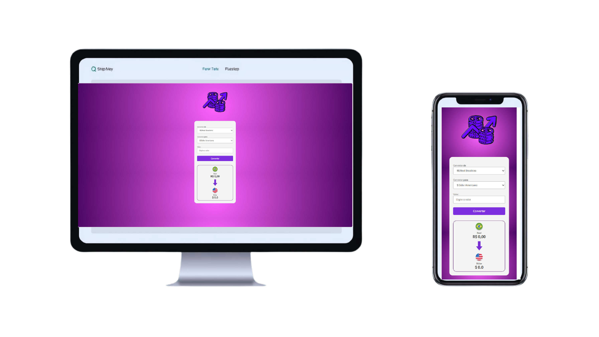

<h1 align="center">💱 Conversor de Moedas</h1>

  

  <strong>Projeto desenvolvido com HTML, CSS e JavaScript</strong> 
  Durante meus estudos no <strong>DevClub</strong>, aprendendo do zero e colocando em prática meus primeiros conceitos de programação. 🚀

---

## 🌍 Sobre o Projeto

O **Conversor de Moedas** é uma aplicação web interativa que permite converter valores de **Real Brasileiro (R$)** para outras moedas internacionais, como **Dólar ($)**, **Euro (€)** e **Bitcoin (₿)**.

A proposta do projeto é unir **lógica de programação** com **design intuitivo**, proporcionando uma experiência leve e funcional para o usuário.  

💬 Basta inserir o valor desejado, escolher a moeda e clicar em **Converter** — o resultado aparece instantaneamente!

## 🌍 Moedas Suportadas

🇧🇷 Real Brasileiro → 🇺🇸 Dólar Americano  
🇧🇷 Real Brasileiro → 🇪🇺 Euro  
🇧🇷 Real Brasileiro → 🪙 Bitcoin

 

---
## 📸 Demonstração

   
  <em>Interface moderna e intuitiva para conversões rápidas 💸</em>

## 🧠 Aprendizados

Durante o desenvolvimento deste projeto, aprimorei meus conhecimentos em:

- 🔹 Estruturação de páginas com **HTML5**
- 🎨 Estilização com **CSS3** (trabalhando com imagens, fontes e layout responsivo)
- ⚡ Manipulação do **DOM com JavaScript**
- 🧩 Criação de eventos e funções para cálculos dinâmicos
- 🚀 Organização de código e boas práticas

---

## 🛠️ Tecnologias Utilizadas

| 💻 Tecnologia | 💡 Função Principal |
|---------------|---------------------|
| **HTML5** | Estrutura da página |
| **CSS3** | Estilização e layout |
| **JavaScript** | Lógica e interatividade |

---

## 🚀 Como Executar o Projeto

1. Faça o clone deste repositório:
   
   git clone https://github.com/Gustavolopes-dev/conversor-de-moedas

